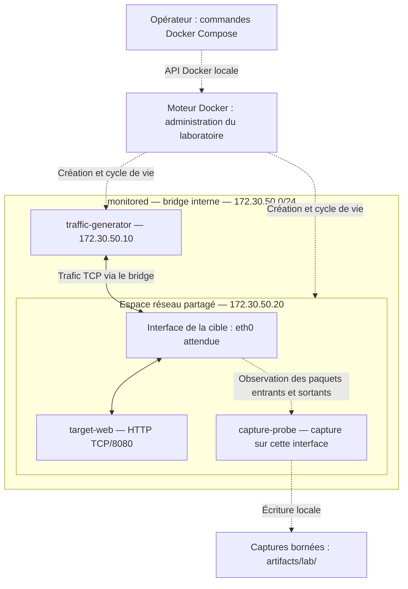

# Étape 1.2 — Topologie réseau du laboratoire

Statut : topologie définie ; visibilité à éprouver en 1.3, isolation à vérifier en 1.4 et configuration Compose à construire en 1.5.

## 1. Objectif et choix retenu

Le laboratoire minimal comporte trois services : `traffic-generator`, `target-web` et `capture-probe`. Il prépare le scénario de scan vertical NG-NET-001 avec une source et une cible. `capture-probe` désigne l'outil technique de preuve de capture ; le sensor NetGuard sera implémenté à l'étape 2 de la roadmap.

Le générateur et la cible sont connectés au réseau Docker `monitored`. Le capteur partage l'espace réseau de la cible avec le mécanisme Compose `network_mode: service:target-web`. Les deux services partagent donc interfaces, adresses, routes et ports réseau, tout en conservant des processus et systèmes de fichiers distincts. Le capteur n'a pas d'adresse IP indépendante.

Ce choix rend les échanges de la cible accessibles au point de capture sans miroir du bridge ni routeur intermédiaire. La disponibilité réelle des paquets et des permissions reste à démontrer en 1.3. Le capteur observe passivement ; il ne relaie pas le trafic et n'est pas un pare-feu.

Références techniques : [mode réseau Compose](https://docs.docker.com/reference/compose-file/services/#network_mode) et [partage de pile réseau Docker](https://docs.docker.com/engine/network/#container-networks).

## 2. Schéma

Les traits pleins représentent le trafic testé ; les traits pointillés représentent l'administration, l'observation ou la sortie de fichiers. Le schéma n'implique pas que les paquets traversent le processus du capteur.

## 3. Réseau et plan d'adressage

| Élément | Valeur de référence | Utilisation |
| --- | --- | --- |
| Projet Compose | `netguard-lab` | Isole les noms des ressources du lab. |
| Clé de réseau Compose | `monitored` | Bridge créé par le projet ; pas de réseau externe réutilisé. |
| Sous-réseau IPv4 | `172.30.50.0/24` | Valeur de référence configurable avant démarrage. |
| Adresse du bridge / passerelle IPAM | `172.30.50.1` | Réservée à Docker ; ne constitue pas une autorisation de sortie. |
| Générateur | `172.30.50.10` | Source des scénarios. |
| Cible et espace réseau du capteur | `172.30.50.20` | Destination des scénarios et interface observée. |
| Adresse réseau / broadcast | `172.30.50.0` / `172.30.50.255` | Non attribuables aux services. |

Les autres adresses restent non attribuées dans le lab minimal. Les valeurs seront externalisées dans la configuration technique lors de la construction ; elles ne seront pas codées dans le Core ou dans les détecteurs. La résolution du nom `target-web` pourra faciliter l'utilisation ; les captures seront interprétées avec les adresses réellement configurées.

Avant tout déploiement, comparer ce sous-réseau aux réseaux Docker existants et aux routes de l'environnement, y compris les VPN. En cas de chevauchement, choisir un autre sous-réseau privé et mettre à jour ensemble la passerelle et les adresses des services. La plage proposée ne constitue pas une garantie universelle d'absence de conflit. Le contrôle des réseaux Docker reste un préalable aux essais ; aucune absence de conflit complète n'est certifiée ici.

Le réseau sera défini avec le driver `bridge` et `internal: true`. Aucun service du lab minimal ne sera rattaché à un second réseau offrant une sortie externe. IPv6 n'est pas activé pour ce premier périmètre. [Réseaux internes Compose](https://docs.docker.com/reference/compose-file/networks/#internal).

## 4. Services, interfaces et ports

| Service | Connexion réseau | Écoute / rôle | Ports publiés sur l'hôte |
| --- | --- | --- | --- |
| `traffic-generator` | `monitored`, adresse `.10` | Client TCP/HTTP ; aucun serveur requis. | Aucun. |
| `target-web` | `monitored`, adresse `.20` | HTTP sur `0.0.0.0:8080` dans son espace réseau. | Aucun. |
| `capture-probe` | Espace réseau de `target-web` | Capture de l'interface qui porte `.20` ; aucun serveur requis. | Aucun. |

Le port 8080 permet d'éviter une écoute sur un port privilégié. Le nom d'interface attendu avec cet attachement unique est `eth0` ; il doit être contrôlé en 1.3 et fourni explicitement à l'outil de capture. La capture de référence porte sur cette interface, pas sur `lo` ni sur toutes les interfaces indistinctement.

La future définition de `capture-probe` utilisera `network_mode: service:target-web` sans attribut `networks` propre. Compose interdit de combiner ces deux attributs. Ajouter ultérieurement un réseau de management au capteur nécessitera de revoir ce choix : une interface ajoutée à cet espace réseau serait également accessible à la cible.

## 5. Chemins et communications prévues

| Source | Destination | Protocole / chemin | Finalité et politique attendue |
| --- | --- | --- | --- |
| Générateur | Cible, TCP/8080 | Interface générateur → bridge → interface cible | Requêtes HTTP normales, autorisées. |
| Générateur | Cible, liste de ports TCP | Même chemin, par exemple 8000–8019 et 8080 | Scan vertical borné ; les ports sans service restent fermés. |
| Cible | Générateur, ports éphémères du client | Interface cible → bridge → interface générateur | Réponses TCP/HTTP et refus TCP des ports fermés. |
| Services du lab | Résolution interne Docker, si utilisée | Résolution du nom de service | Usage technique limité au lab ; pas de dépendance à un DNS externe. |
| Opérateur | Moteur Docker local | API Docker depuis l'hôte | Démarrage, arrêt, inspection et lecture des journaux. |
| Capteur | `artifacts/lab/` | Écriture dans un volume ou montage dédié | Captures temporaires ; pas de transport réseau vers un collecteur. |
| Services du lab | Internet, réseau local et services de l'hôte hors besoin explicite | Hors périmètre | Accès à empêcher et à tester en 1.4. |
| Autres projets / clients externes | Services du lab | Hors périmètre | Aucun port publié ; isolation inter-réseaux à vérifier en 1.4. |

La liste de ports illustre un scénario ; elle ne fixe ni le seuil ni la fenêtre de détection de NG-NET-001. Ces paramètres relèvent de la conception du détecteur. Un port fermé doit rester joignable au niveau réseau pour que la tentative et, lorsque le système la produit, sa réponse RST soient observables.

Cette table décrit les échanges prévus. Un bridge permet aussi d'autres communications entre ses membres : elle ne constitue pas une ACL déjà appliquée. `internal: true` et l'absence de ports publiés ne suffisent pas à garantir toutes les restrictions, notamment vis-à-vis de l'hôte, de la passerelle ou des mécanismes DNS. Leur comportement et les mesures complémentaires seront vérifiés en 1.4. Le trafic ARP nécessaire au réseau peut être présent ; il est distinct du trafic TCP analysé.

## 6. Administration et séparation des responsabilités

Le laboratoire minimal n'a pas de réseau Docker de management dédié. Son administration utilise le moteur Docker depuis l'hôte, et les captures sont récupérées sous forme de fichiers. Aucun serveur SSH, API NetGuard ou dashboard n'est nécessaire à cette étape ; aucun socket Docker n'est monté dans les services.

Les futurs services API, dashboard et persistance nécessiteront une extension documentée de la topologie, avec leur propre exposition et leurs frontières. Le choix du laboratoire actuel ne leur attribue pas les permissions de capture ni l'espace réseau de la cible.

## 7. Visibilité attendue et limites

- Le capteur doit voir les paquets TCP entrants et sortants de la cible sur l'interface observée, avec adresses, ports, flags et timestamps exploitables.
- Le chemin direct entre deux membres du bridge ne prévoit pas de traduction d'adresses : les captures doivent conserver la source `.10` et la destination `.20`, puis l'inverse pour les réponses. Ce résultat sera vérifié.
- La capture ne couvre pas les échanges entre deux autres conteneurs, ni une deuxième cible ajoutée ailleurs, ni les échanges locaux à `lo` lorsque seule l'interface réseau est observée.
- Le partage de réseau réduit la séparation entre cible et capteur : les ports et le loopback sont communs. Aucun service d'administration du capteur ne doit y être exposé. Ce montage est limité à une cible contrôlée du laboratoire ; il ne démontre pas un déploiement de supervision indépendant de la cible.
- Une capture passive décrit le comportement prévu du processus. Les permissions techniques nécessaires ne garantissent pas, à elles seules, l'impossibilité d'émettre du trafic.
- Une absence de paquets ou d'alertes ne prouve pas une absence d'activité. Pertes, filtres, sens de capture et disponibilité du capteur doivent rester explicites.

Le premier essai cherchera à capturer sans mode promiscuité, avec suppression des capabilities inutiles et ajout de `NET_RAW` si nécessaire. `NET_ADMIN`, le réseau de l'hôte, le montage du socket Docker et `privileged: true` ne sont pas des prérequis retenus. L'utilisateur d'exécution et les permissions réellement nécessaires seront éprouvés en 1.3 puis consolidés en 1.4. Référence : [sockets de capture Linux et CAP_NET_RAW](https://man7.org/linux/man-pages/man7/packet.7.html).

## 8. Cycle de vie et validation suivante

Ordre attendu : créer le réseau et la cible → attendre la disponibilité HTTP → démarrer le capteur dans l'espace réseau de la cible → confirmer que la capture est prête → lancer le scénario. Un conteneur démarré ne suffit pas à prouver la disponibilité de son service.

La recréation de la cible impose la recréation du capteur associé et une nouvelle vérification de capture avant de reprendre les scénarios. Le partage de réseau crée cette dépendance de cycle de vie. À l'arrêt : arrêter le générateur, terminer et fermer la capture, puis arrêter la cible et retirer le réseau du projet.

La preuve 1.3 doit montrer :

1. Une requête HTTP générateur → cible et sa réponse dans la capture.
2. Des tentatives vers plusieurs ports fermés de la même cible et les réponses attendues.
3. La cohérence des adresses, ports, directions et timestamps avec le scénario lancé.
4. L'absence de visibilité revendiquée au-delà du périmètre de la cible.
5. Le rétablissement de la capture après recréation de la cible et du capteur.

## 9. Résultat de 1.2

Les composants, leur attachement réseau, le plan d'adressage de référence, les chemins de trafic, les accès d'administration et les limites de visibilité sont définis. La topologie reste à éprouver ; aucun fichier Compose exécutable, image, script ou code métier n'est livré dans cette sous-étape.

Suite : **1.3 — Positionnement du capteur et preuve de visibilité**, puis **1.4 — Isolation et permissions**. Le contrôle des conflits d'adressage fait partie des prérequis du premier essai.
